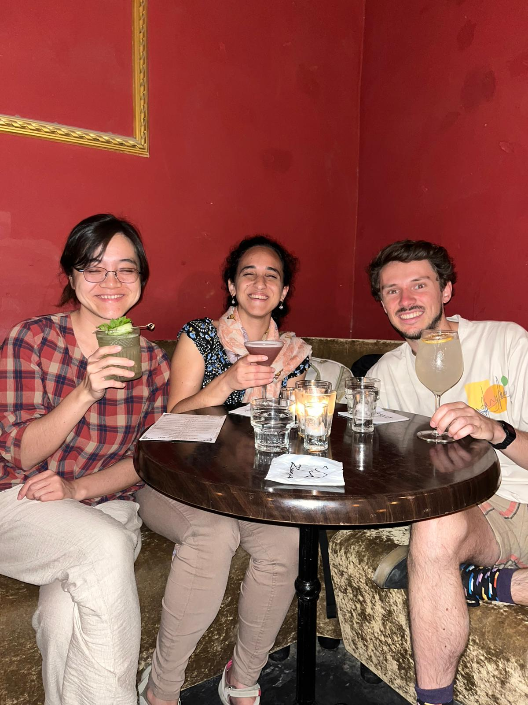
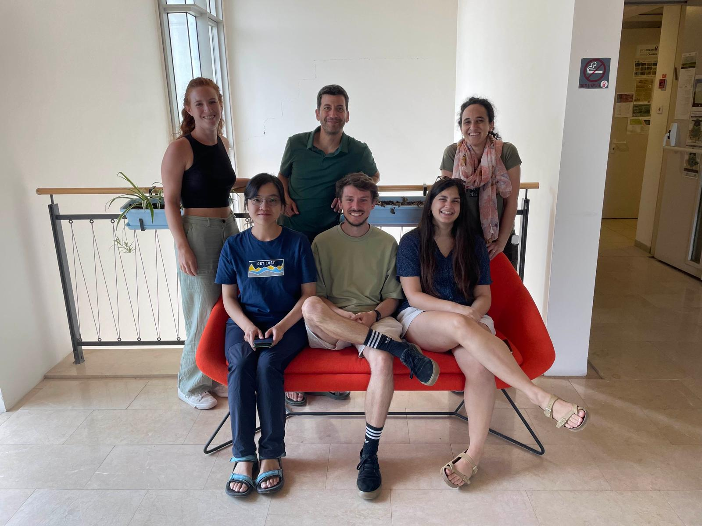
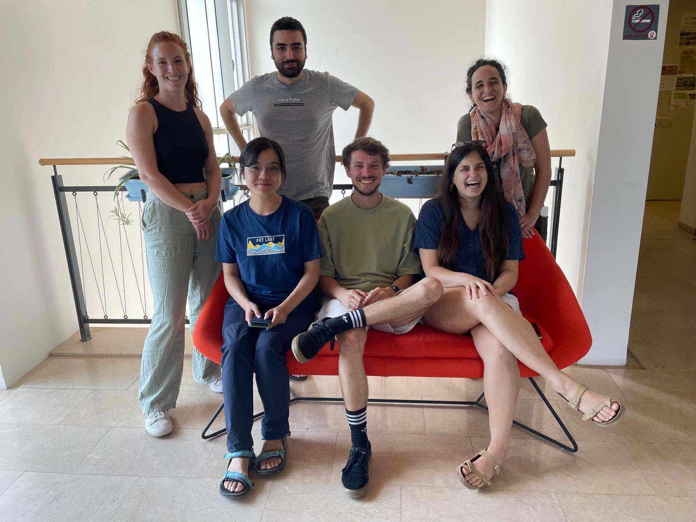

Following EcoNet2023, Johannes Nauta (postdoctoral researcher, Dept. of Physics, University of Padua, Italy) extended his stay in our lab for an extra week as part of our HFSP-funded collaboration project. Ying Jie and Johannes led intensive discussions and worked hard to model microbiome population dynamics under perturbations using different approaches. Johannes employed ODE systems in his modeling approach, while Ying Jie explored the domain of agent-based modeling. It was a productive week and we are looking forward to the results.
 

    
    
    

