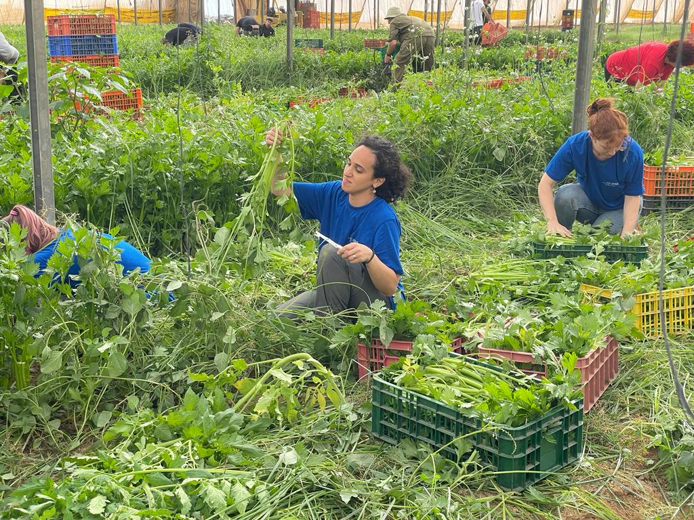
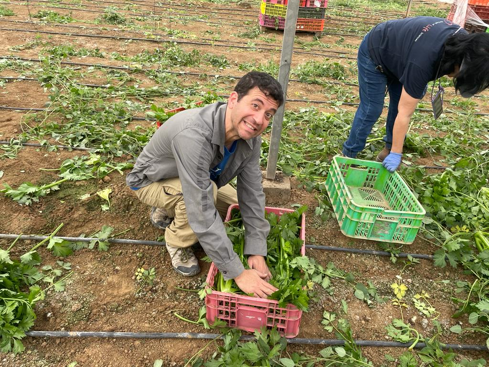
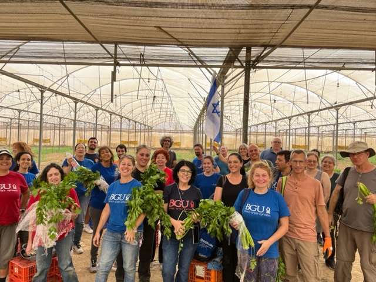
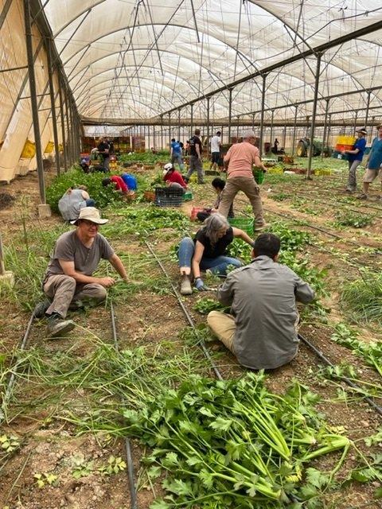
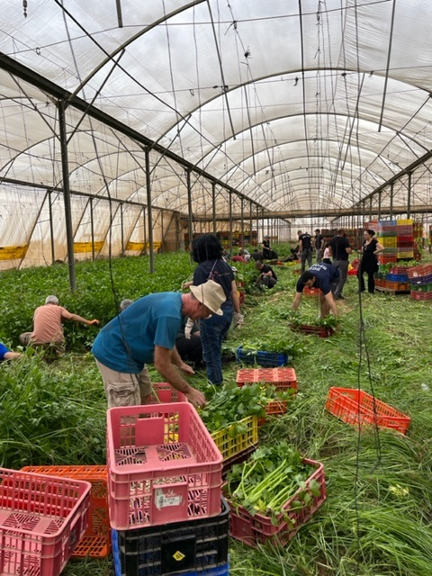
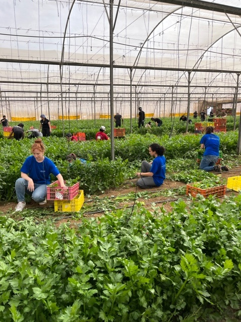

We encounter challenges that call for collective action during these challenging times (Israel–Hamas War, 2023). To support national agricultural initiatives and strengthen our community, we volunteered at Moshav farm to harvest on Sunday, November 12th, 2023.

    
    
     
    
    
    
    
     
    
    
    

 
 <!-- 

    
    
     
    
    
    
    
   
    
    
    

-->
